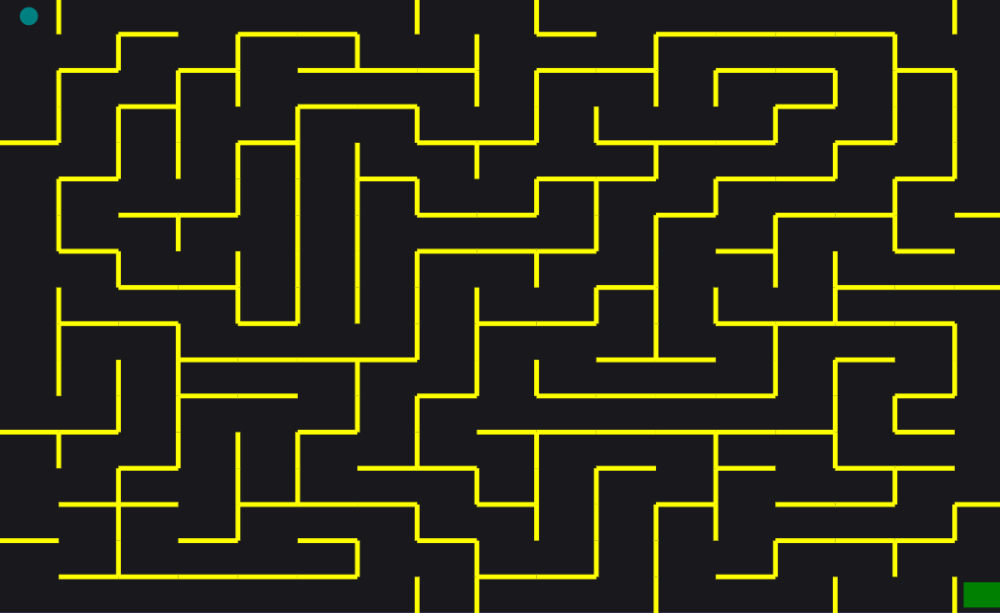

# **About**

The focus of this project is to use a recursive algorithm to generate a maze. The maze difficulty is dependent on a user defined grid size which the program iterates through to draw a random maze. 

## **How to Play**

Choose a predefined difficulty such as Easy, Medium, Hard, or Insane. After you win you can define a custom grid size up to 99x99 cells if you want to make things more difficult.

### **Preview of Maze**

